# Zabbix template for ClickHouse

How to set up server with Zabbix agent:
  * Ensure `xmllint` is installed.
  * Ensure `clickhouse-client` is installed.
  * Clone this repo.
  * Edit `/etc/zabbix/zabbix_agentd.conf`. Add the following line:
```bash
	UserParameter=ch_params[*],bash /PATH/TO/zbx_clickhouse_monitor.sh "$1" "HOST_WHERE_CH_IS_RUNNING" "ADDITIONAL CLICKHOUSE-CLIENT PARAMS"
```
  where:
  * `/PATH/TO/zbx_clickhouse_monitor.sh` depends on where you've cloned this repo.
  * `HOST_WHERE_CH_IS_RUNNING` is optional parameter, in case none specified `localhost` would be used
  * `ADDITIONAL CLICKHOUSE-CLIENT PARAMS` is optional string appended to any clickhouse-client call. Useful if authorization or ssl required

And finally
  * Import `zbx_clickhouse_template.xml` in zabbix (**zabbix -> Configuration -> Templates -> Import**).

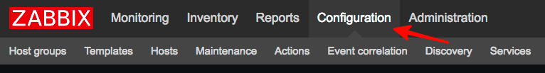
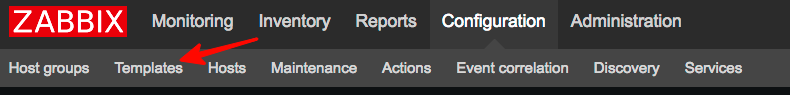
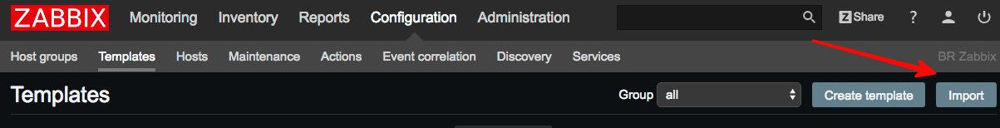
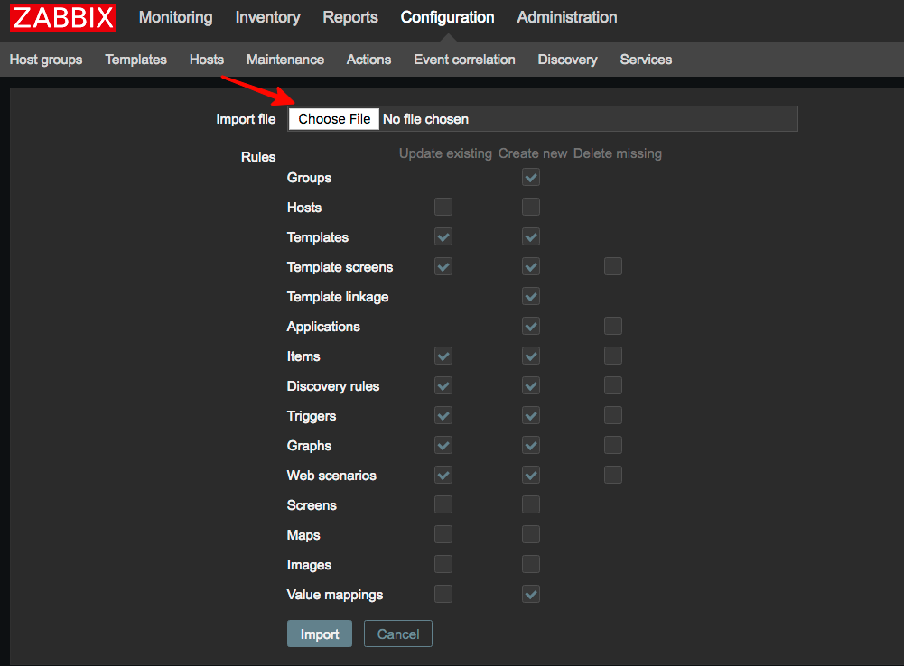
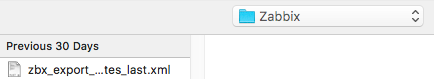
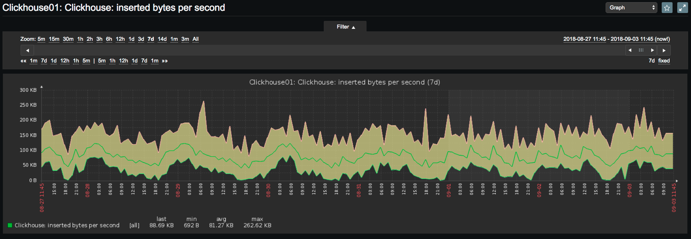
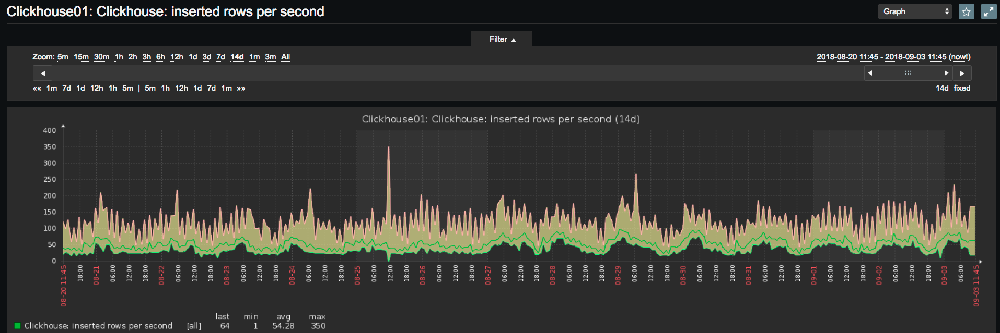
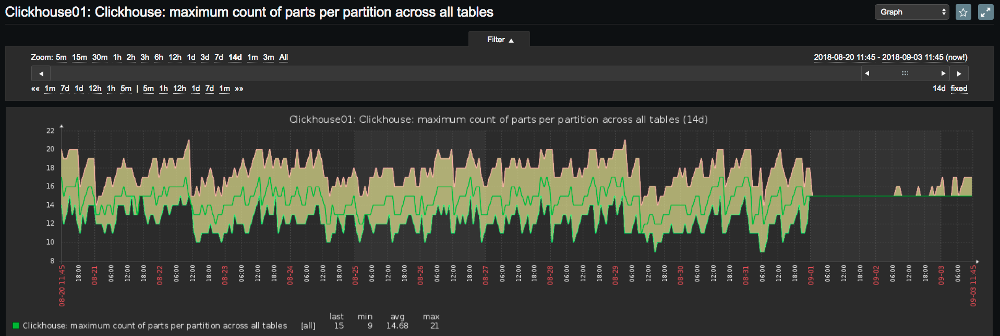
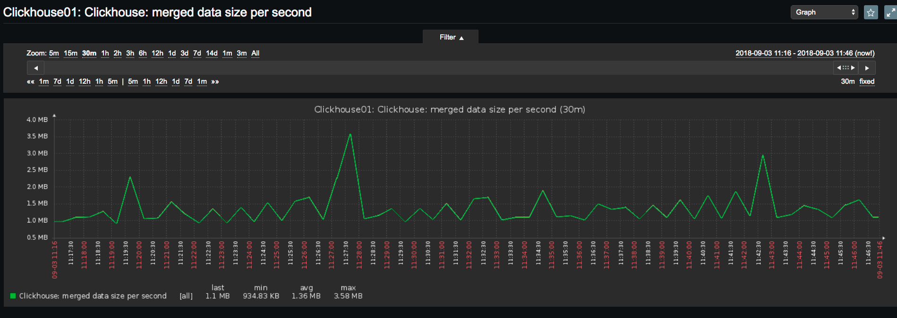
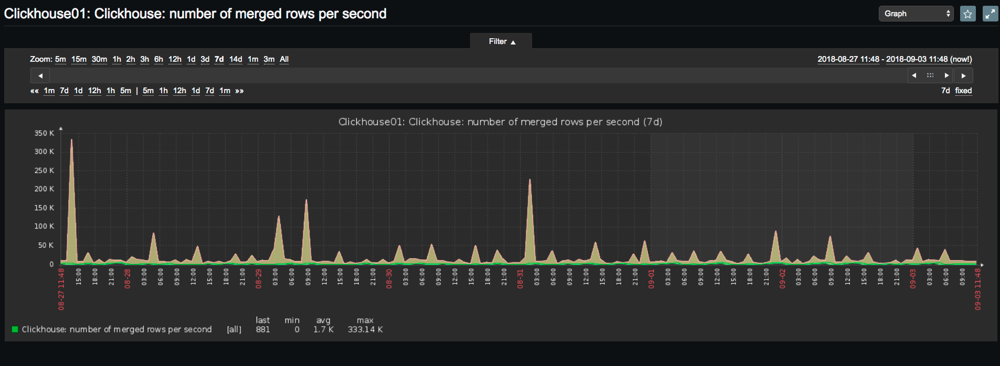
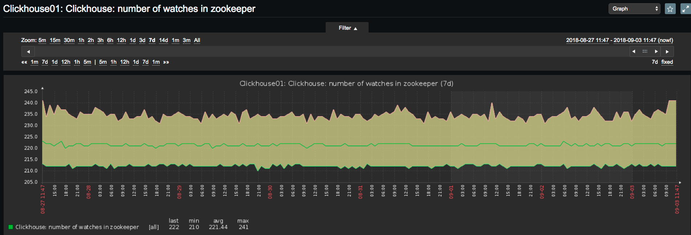

